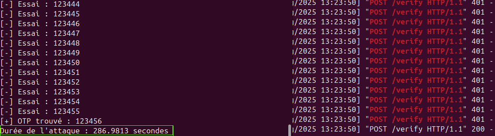
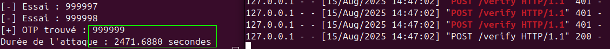
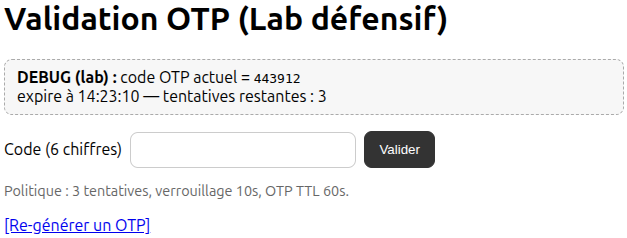
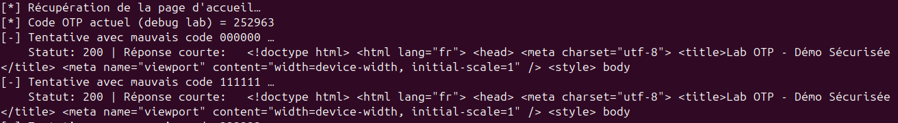
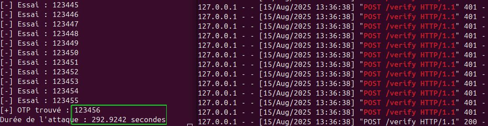
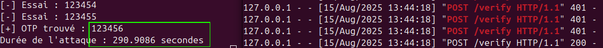

# Expérimentation : Brute force sur OTP et politiques de sécurité


## Expérience

### 1. Mise en place

- **Serveur Flask** : génère un OTP à 6 chiffres.
- **Script Python** : tente toutes les combinaisons possibles de `000000` à `999999`.
- **Nombre total de combinaisons** :  Règle des multiplications → 10 possibilités par chiffre × 6 chiffres = **10⁶ = 1 000 000 combinaisons**.

### 2. Résultats des tests

| OTP choisi | Temps trouvé (environ)       |
| ---------- | ---------------------------- |
| `000000`   | 0.0028 secondes              |
| `123456`   | ~287 secondes (~ 5 minutes)  |
| `999999`   | 2472 secondes (~ 41 minutes) |
| 654321     | 1652 secondes (~ 28 minutes) |
| 111111     | ~269 secondes                |





On peut remarquer que toutes les combinaisons possibles peuvent être testées en moins de 45 minutes. Ces résultats montrent que **sans protection**, un OTP (à 6 chiffres) peut être cassé **en moins d'une heure**, loin d’être un rempart efficace contre une attaque automatisée.


## 3. Politiques de sécurité testées

J’ai intégré une interface web en Flask permettant de configurer plusieurs protections :

1. **Verrouillage après X tentatives** (exemple : 3 essais).
2. **Verrouillage temporaire** (exemple : 10 secondes après un échec).
3. **Vérification d’identité** (exemple : pièce d’identité ou second facteur).
4. **TTL (Time To Live)** : expiration de l’OTP après 60 secondes.



***À faire dans en prod** : Journalisation et blocage IP, CAPTCHA, 2FA matériel, TOTP (RFC 6238), Analyse des connexions suspectes via **géolocalisation**, etc.*

J'ai aussi mis en place un script `tester.py` pour automatiser le test du système de protection précédent. 

Le script : 

- récupère la page d’accueil, obtient le code OTP en mode debug,  
- effectue plusieurs tentatives de connexion avec des codes corrects ou incorrects
- gère automatiquement les verrouillages temporaires en cas de trop nombreuses tentatives échouées
- affiche pour chaque essai le code utilisé, le statut HTTP et un extrait de la réponse du serveur. 



## Appel à la conscience

Cette expérience ne concerne pas seulement les OTP. Les **mots de passe** souffrent du **même problème** : si vous utilisez un mot de passe simple, court ou réutilisé, un attaquant peut aussi le trouver par force brute ou dictionnaire **en un temps ridiculement court**. Des politiques de sécurité sont aussi à prévoir pour limiter les tentatives... 

### Conseils essentiels :

- Demander aux usagers d'utiliser des **mots de passe longs** (au moins 12 caractères).
- Mélanger lettres, chiffres et caractères spéciaux.
- Éviter les mots du dictionnaire et les suites logiques (`123456`, `password`…).
- Activer la **double authentification**.
- Mettre en place des **limitations de tentatives** et des verrous temporaires.

---

## Conclusion

Ne vous contentez pas de “générer un OTP” ou de “demander un mot de passe” : **sécurisez le processus autour**.

**Un OTP ou un mot de passe sans politique de sécurité est une porte ouverte.**

---

## Code source

Le code complet (serveur Flask + brute force + interface web de sécurité) est disponible sur mon GitHub :  https://github.com/Bamolitho/OTP-Attack-Defense/


### Observation : Variabilité du temps de brute force pour un même OTP

Lors de mes expériences avec le brute force sur des OTPs, j’ai remarqué que le temps nécessaire pour trouver un même OTP n’est pas toujours identique. Par exemple, pour l’OTP **123456**, les mesures obtenues lors de différentes tentatives sont les suivantes :

- Première expérience : 287 secondes
- Deuxième expérience : 292 secondes
- Troisième expérience : 290 secondes
- Quatrième expérience : 280 secondes



  

Cette variation peut sembler surprenante au premier abord, mais elle s’explique par plusieurs facteurs :

1. **Latence du réseau et communication serveur-client** : Même dans un environnement local, le temps de traitement des requêtes fluctue légèrement selon la charge du système et les processus en cours.
2. **Ordre et timing des tentatives** : Si le script ne teste pas toutes les combinaisons à vitesse strictement constante, certaines itérations peuvent être plus rapides ou plus lentes.
3. **Conditions du système** : Les performances CPU, l’utilisation de la mémoire ou d’autres programmes actifs peuvent influencer la vitesse d’exécution du script.
4. **Aléa naturel des mesures** : Toute expérience répétée comporte une variabilité intrinsèque, surtout pour des durées mesurées en secondes.

Cette observation souligne qu’il est important de **réaliser plusieurs mesures pour chaque OTP** et de **calculer des valeurs statistiques** (moyenne, médiane, variance) pour modéliser correctement le temps attendu pour un brute force.


# Lab OTP Défensif (Flask) + Client de test (requests) (app.py et tester.py)

**Objectif pédagogique :** démontrer un flux OTP correct avec expiration, limitation de tentatives et verrouillage temporaire.
⚠️ Ce lab n'est pas un outil de brute force. Il illustre des **mécanismes de défense**.

## Prérequis

- Python 3.10+ recommandé
- `pip` installé

## Installation

```bash
python -m venv .venv
source .venv/bin/activate  # Windows: .venv\Scripts\activate
pip install -r requirements.txt
```

## Lancer le serveur

```bash
export FLASK_SECRET_KEY="change-me"
export OTP_TTL_SECONDS=60
export LOCK_COOLDOWN_SECONDS=10
export MAX_ATTEMPTS=3
export DEBUG_SHOW_CODE=1
python app.py
```

Le serveur écoute sur http://127.0.0.1:5000

## Tester automatiquement (limité et légal)

Dans un autre terminal (après avoir démarré le serveur) :

```bash
python tester.py
```

Le script :

- ouvre une session,
- effectue **3 mauvais essais** puis observe le verrouillage,
- patiente le temps du verrouillage,
- récupère le code *debug* et démontre une validation réussie.

## Ce que tu peux modifier

- `LOCK_COOLDOWN_SECONDS` pour tester le verrouillage.
- `MAX_ATTEMPTS` pour changer le nombre de tentatives.
- `OTP_TTL_SECONDS` pour l'expiration de l'OTP.

## Bonnes pratiques défensives illustrées

- **Limitation stricte des tentatives** par session.
- **Verrouillage temporaire** après échecs répétés.
- **Expiration rapide** des OTP.
- **Régénération** d'un OTP après succès.
- (À faire dans un vrai projet) Journalisation et blocage IP, CAPTCHA, 2FA matériel, TOTP (RFC 6238), etc.

## Avertissement

Ce code est uniquement pour un laboratoire **local** que tu contrôles. N'utilise pas d'automatisation contre des services tiers.
